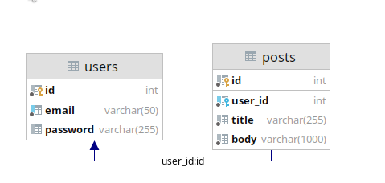

# simple-crud-golang

Проект создан в процессе обучения. Используется подход чистой архитектуры. Общение с базой данных происходит на уровне repository и использует GORM.

Также используется ECHO framework как web framework. Реализована авторизация с использованием JWT и регистрация через Google Oauth.
Доступна документация Swagger

Для корректной работы необходим файл .env c переменными

```
GOOGLE_OAUTH_CLIENT_ID=""
GOOGLE_OAUTH_SECRET=""

DB_NAME=""
DB_USERNAME=""
DB_PASSWORD=""
```

схема базы данных

